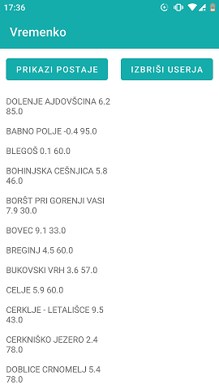

Naslov projekta: VREMENKO

Avtorja: Matija Keber, Matej Rupnik

Slike:

1. Grafični vmesnik spletne Aplikacije

2. Grafični vmesnik mobilne Aplikacije

Izbris uporabnika na mobilni aplikaciji

Opis delovanja clotnega sistema:

Vremenko je spletna rešitev, ki trenutno vremensko stanje iz vremenskih postaj prikaže na spletu in na mobilni aplikaciji.
Podatke o vremenskem stanju rešitev pridobiva na vsako minuto preko javnega XML dokumenta organizacije ARSO, ki je dostopna na naslednji povezavi: "https://meteo.arso.gov.si/uploads/probase/www/observ/surface/text/sl/observation_si_latest.xml"
Strežnik vsebino XML datoteke prebere in iz nje izvleče določene podatke, ki jih nato zapiše v podatkovno bazo.
Iz podatkovne baze strežnik ob zahtevi uporabnika prikaže najnovejše podatke za vsako od vremenskih postaj.

Delitev dela:

Matija Keber: Spletna stran, Spletna storitev, Podatkovna baza

Matej Rupnik: Preslikava XML v Podatkovno bazo, Povezava na podatkovno bazo, Mobilna aplikacija

Slika podatkovnega modela podatkovne baze:

